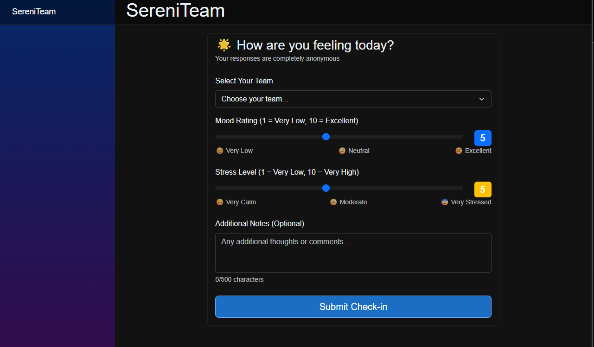

# SereniTeam

[](https://dotnet.microsoft.com/)
[](https://blazor.net/)
[](https://postgresql.org/)
[](https://docs.microsoft.com/en-us/aspnet/signalr/)
[](LICENSE)
[](https://github.com/yourusername/SereniTeam)

SereniTeam is a **real-time wellness dashboard** for remote teams, built with Blazor WebAssembly and ASP.NET Core. It collects anonymous check-ins, visualizes team sentiment trends, and alerts leads to potential burnout - all while preserving privacy.



## Features

### Anonymous Check-ins
- Secure, anonymous wellness submissions
- Mood and stress level tracking (1-10 scale)
- Optional notes without personal identification
- No individual data exposure to management

### Real-time Dashboard
- Live team wellness metrics
- Interactive trend visualizations
- Burnout risk indicators
- Historical data analysis

### Burnout Detection
- Configurable alert thresholds
- Multi-day trend analysis
- Severity classification (Low/Medium/High)
- Proactive team health monitoring

### Team Management
- Multi-team organization support
- Team creation and administration
- Role-based access control
- Scalable team structure

## Quick Start

### Prerequisites

- [.NET 8 SDK](https://dotnet.microsoft.com/download/dotnet/8.0)
- [PostgreSQL 13+](https://www.postgresql.org/download/)
- [Git](https://git-scm.com/)

### Installation

1. **Clone the repository**
   ```bash
   git clone https://github.com/yourusername/SereniTeam.git
   cd SereniTeam
   ```

2. **Setup PostgreSQL**
   ```bash
    # Option A: Local PostgreSQL
    createdb sereniteam_dev
  
    # Option B: Docker
    docker run --name sereniteam-postgres \
    -e POSTGRES_PASSWORD=dev_password \
    -e POSTGRES_DB=sereniteam_dev \
    -p 5432:5432 -d postgres:15
    ```
3. **Configure Database**
    
   Update `src/SereniTeam.Server/appsettings.Development.json`:
   ```json
   {
     "ConnectionStrings": {
       "DefaultConnection": "Host=localhost;Database=sereniteam_dev;Username=postgres;Password=dev_password"
     }
   }
    ```

5. **Install Dependencies**
   ```bash
   dotnet restore
   ```

6. **Setup Database**
   ```bash
   dotnet ef migrations add InitialCreate --project src/SereniTeam.Server
   dotnet ef database update --project src/SereniTeam.Server
   ```

7. **Run the Application**
   ```bash
   # Set development environment
   set ASPNETCORE_ENVIRONMENT=Development  # Windows
   export ASPNETCORE_ENVIRONMENT=Development  # macOS/Linux
   
   # Start the application
   dotnet run --project src/SereniTeam.Server
   ```

8. **Access the Application**
   
   - Navigate to `https://localhost:5001` or `http://localhost:5000`
   - API Documentation: `https://localhost:5001/swagger`
